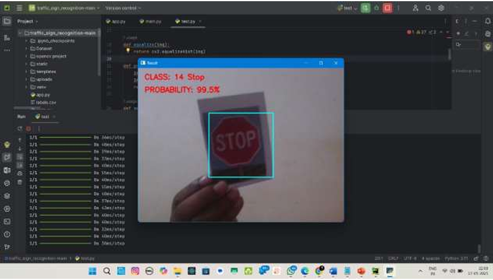
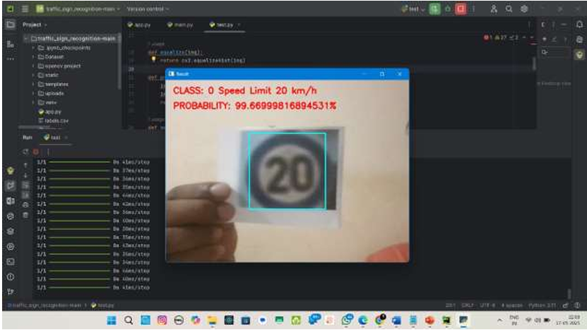
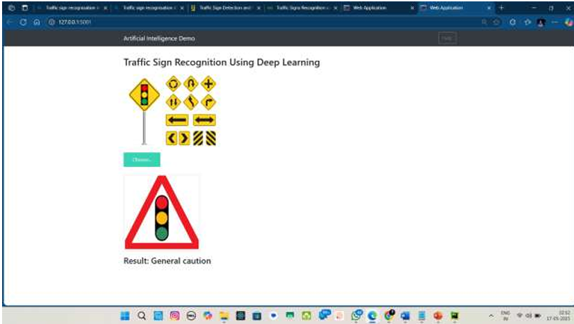
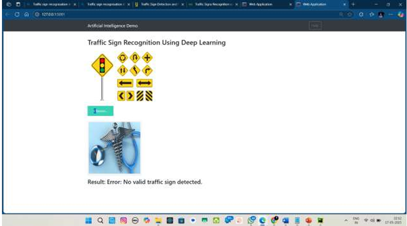

# 🚦 Traffic Sign Recognition Using CNN

A deep learning-based traffic sign detection and classification system built with **Convolutional Neural Networks (CNN)**. The system can recognize **43 types of traffic signs** in real-time using a webcam, and also supports image upload via a web interface.

> Final Year B.E. Project — Computer Science & Engineering  
> Visvesvaraya Technological University (VTU), 2024–25  
> Cambridge Institute of Technology North Campus, Bengaluru

---

## 👥 Team Members

| Name | USN |
|------|-----|
| Prajwal N J | 1AJ21CS077 |
| Rakshith K M | 1AJ21CS083 |
| Sai Kiran S | 1AJ21CS088 |
| Shamanth S J | 1AJ21CS091 |

**Guide:** Prof. Somshekhar D, Dept. of CSE, CIT NC

---

## 📌 Project Overview

Traditional traffic sign detection relied on manual feature engineering and struggled under real-world conditions like poor lighting, occlusion, and background clutter. This project addresses those limitations using a CNN-based approach that automatically learns visual features from raw image data.

The system:
- Trains a custom CNN on the **GTSRB (German Traffic Sign Recognition Benchmark)** dataset
- Classifies traffic signs into **43 categories**
- Performs **real-time detection** via webcam using OpenCV
- Includes a **Flask web application** for image-based prediction

---

## 🗂️ Repository Structure

```
Traffic-Sign-Detection-Using-CNN/
│
├── Dataset.zip                  # GTSRB subset (43 classes)
├── labels.csv                   # Class label mappings
├── model.h5                     # Trained CNN model
│
├── main.py                      # Model training script (Jupyter/Python)
├── test.py                      # Real-time webcam detection script
├── app.py                       # Flask web app
├── app_combined.py              # Combined Flask app
│
├── templates/                   # HTML templates for web UI
├── static/                      # CSS/JS assets
├── uploads/                     # Uploaded images for prediction
└── outputs/                     # Output screenshots
```

---

## 🧠 Model Architecture

A custom sequential CNN trained from scratch:

```
Input (32×32×1 grayscale image)
    ↓
Conv2D(60, 5×5, relu)
Conv2D(60, 5×5, relu)
MaxPooling2D(2×2)
    ↓
Conv2D(30, 3×3, relu)
Conv2D(30, 3×3, relu)
MaxPooling2D(2×2)
Dropout(0.5)
    ↓
Flatten
Dense(500, relu)
Dropout(0.5)
    ↓
Dense(43, softmax)   ← Output: 43 traffic sign classes
```

**Training Config:**
- Loss: Categorical Cross-Entropy
- Optimizer: Adam (lr = 0.001)
- Epochs: 10–30
- Batch Size: 32
- Data Augmentation: rotation, zoom, shear, width/height shift

---

## 📊 Results

| Metric | Value |
|--------|-------|
| Test Accuracy | ~66% (base model) |
| Confidence Threshold (real-time) | 90% |
| Sign Classes | 43 |
| Dataset | GTSRB (~50,000 images) |

---

## 🖼️ Output Screenshots

### ✅ Stop Sign Detected — 99.5% Confidence
Real-time webcam detection correctly identifying a **Stop sign (Class 14)**.



---

### ✅ Speed Limit 20 km/h Detected — 99.67% Confidence
Real-time webcam detection correctly classifying a **Speed Limit 20 km/h sign (Class 0)**.



---

### ✅ Web App — General Caution Sign
Flask web interface successfully classifying an uploaded image as **"General caution"**.



---

### ❌ Web App — No Valid Sign Detected
When a non-traffic-sign image is uploaded, the system correctly rejects it.



---

## 🛠️ Tech Stack

| Category | Tools |
|----------|-------|
| Language | Python 3 |
| Deep Learning | TensorFlow, Keras |
| Computer Vision | OpenCV |
| Data Processing | NumPy, Pandas |
| Visualization | Matplotlib |
| Evaluation | Scikit-learn |
| Web Framework | Flask |
| IDE | Jupyter Notebook, VS Code, Google Colab |
| Dataset | GTSRB (German Traffic Sign Recognition Benchmark) |

---

## ⚙️ Setup & Installation

### 1. Clone the Repository
```bash
git clone https://github.com/Prajwalnj19/Traffic-Sign-Detection-Using-CNN.git
cd Traffic-Sign-Detection-Using-CNN
```

### 2. Install Dependencies
```bash
pip install tensorflow keras opencv-python numpy pandas matplotlib scikit-learn flask
```

### 3. Prepare the Dataset
- Extract `Dataset.zip` into a folder named `Dataset/`
- Ensure folder structure: `Dataset/0/`, `Dataset/1/`, ..., `Dataset/42/`

### 4. Train the Model
```bash
python main.py
```
This generates `model.h5` — the trained model file.

### 5. Real-Time Webcam Detection
```bash
python test.py
```
- Hold a traffic sign in front of your webcam within the highlighted ROI box
- Press `q` to quit

### 6. Web App
```bash
python app.py
```
Visit `http://127.0.0.1:5000` in your browser to upload images for prediction.

---

## 🚦 Supported Traffic Sign Classes (43 Total)

| Class | Sign | Class | Sign |
|-------|------|-------|------|
| 0 | Speed Limit 20 km/h | 22 | Bumpy Road |
| 1 | Speed Limit 30 km/h | 23 | Slippery Road |
| 2 | Speed Limit 50 km/h | 24 | Road Narrows on Right |
| 3 | Speed Limit 60 km/h | 25 | Road Work |
| 4 | Speed Limit 70 km/h | 26 | Traffic Signals |
| 5 | Speed Limit 80 km/h | 27 | Pedestrians |
| 6 | End of Speed Limit 80 | 28 | Children Crossing |
| 7 | Speed Limit 100 km/h | 29 | Bicycles Crossing |
| 8 | Speed Limit 120 km/h | 30 | Beware of Ice/Snow |
| 9 | No Passing | 31 | Wild Animals Crossing |
| 10 | No Passing (3.5t+) | 32 | End of All Limits |
| 11 | Right-of-way | 33 | Turn Right Ahead |
| 12 | Priority Road | 34 | Turn Left Ahead |
| 13 | Yield | 35 | Ahead Only |
| 14 | Stop | 36 | Go Straight or Right |
| 15 | No Vehicles | 37 | Go Straight or Left |
| 16 | Vehicles Over 3.5t | 38 | Keep Right |
| 17 | No Entry | 39 | Keep Left |
| 18 | General Caution | 40 | Roundabout Mandatory |
| 19 | Dangerous Curve Left | 41 | End of No Passing |
| 20 | Dangerous Curve Right | 42 | End of No Passing (3.5t+) |
| 21 | Double Curve | | |

---

## 🔮 Future Improvements

- Upgrade to advanced architectures (ResNet, EfficientNet)
- Expand dataset with night, rain, and fog conditions
- Model compression for edge device deployment (Raspberry Pi, Jetson Nano)
- Integration with GPS and LiDAR for context-aware detection
- Online/continuous learning for adapting to new sign types

---

## 📄 License

This project was developed for academic purposes under VTU. Dataset credit: [GTSRB — German Traffic Sign Recognition Benchmark](https://benchmark.ini.rub.de/).

---

## 🙏 Acknowledgements

- Prof. Somshekhar D — Project Guide
- Prof. Prathima G — Project Coordinator
- Dr. Sridhar R — HOD, Dept. of CSE, CIT NC
- Dr. Sendamarai P — Principal, CIT NC
